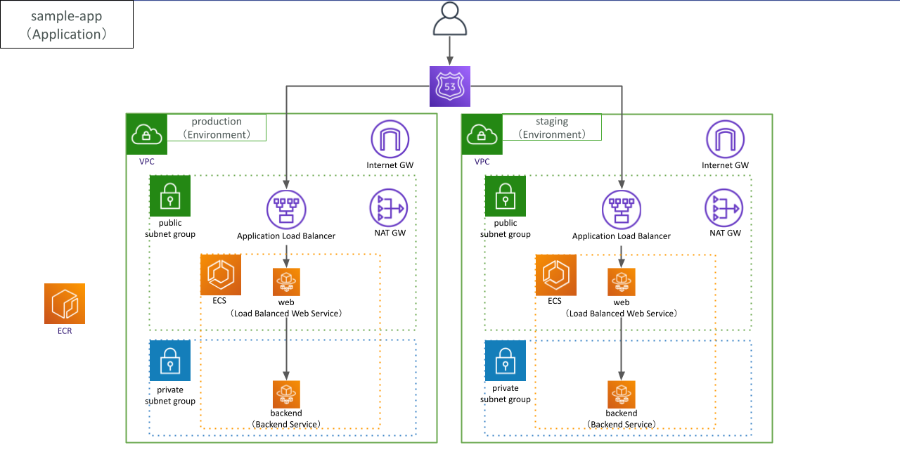

# AWS Copilot Cample Service
このリポジトリは、クラスメソッド株式会社が主催するAWSのオンライン勉強会 AKIBA.AWS #2 ONLINE で発表された「今すぐコンテナを使い始めたい人のためのAmazon ECSとAWS Copilot」に向けたサンプルサービスです。

This repository contains the sample services of "Introduction to Amazon ECS and AWS Copilot for Conrainer Beginners" on AKIBA.AWS ONLINE #2.

- [【4/21（水）リモート開催】AKIBA\.AWS ONLINE \#02 \-このサービスの話がしたい！ IoT Events / Copilot / S3 編\- \#AKIBAAWS \| DevelopersIO](https://dev.classmethod.jp/news/akiba-aws-210421/)

## Directory Structure
```bash
.
├── README.md
├── app
│   ├── Dockerfile
│   └── ......
│   └── ......
└── nginx
    ├── Dockerfile
    └── conf.d
        └── app.conf
```

## Service Structure


### Nginx: Copilot Load Balanced Web Service
```bash
$ cat nginx/conf.d/app.conf
server {
  location /actuator/health {
    proxy_pass http://backend.sample-app.local:80;
  }
  
  location / {
    return 200 "OK";
    add_header Content-Type text/plain;
  }
}
```

### Spring Boot Application: Copilot Backend Service
```bash
$ cd app/
$ ./gradlew build
$ docker build -t aws-copilot-sample-service/app .
$ docker run -d -p 80:80 aws-copilot-sample-service/app
$ curl http://localhost:80/actuator/health
{"status":"UP"}
```

## How to use
### References
- https://github.com/aws/copilot-cli
- https://aws.github.io/copilot-cli/
- https://aws.github.io/copilot-cli/community/guides/

### Install Copilot
```bash
$ brew install aws/tap/copilot-cli
```

### Initialize and Deploy Backend Service
```bash
$ copilot init
Application name: sample-app
Workload type: Backend Service
Service name: backend
Dockerfile: app/Dockerfile
no EXPOSE statements in Dockerfile app/Dockerfile

$ tree copilot
copilot
└── backend
    └── manifest.yml

$ copilot env init --name staging
Which credentials would you like to use to create staging? [profile default]
Would you like to use the default configuration for a new environment?
    - A new VPC with 2 AZs, 2 public subnets and 2 private subnets
    - A new ECS Cluster
    - New IAM Roles to manage services and jobs in your environment
 Yes, use default.
✔ Linked account 123456789012 and region ap-northeast-1 to application sample-app.
✔ Proposing infrastructure changes for the sample-app-staging environment.
✔ Created environment staging in region ap-northeast-1 under application sample-app.

$ copilot svc deploy --name backend --env staging
[+] Building 3.5s (8/8) FINISHED
Login Succeeded
The push refers to repository [123456789012.dkr.ecr.ap-northeast-1.amazonaws.com/sample-app/backend]
✔ Proposing infrastructure changes for stack sample-app-staging-backend
- Creating the infrastructure for stack sample-app-staging-backend
  - Service discovery for your services to communicate within the VPC
  - Update your environment's shared resources
  - An IAM Role for the Fargate agent to make AWS API calls on your behalf
  - A CloudWatch log group to hold your service logs
  - An ECS service to run and maintain your tasks in the environment cluster
  - An ECS task definition to group your containers and run them on ECS
  - An IAM role to control permissions for the containers in your tasks
✔ Deployed backend.
```

### Update Backend Service Manifest File and Deploy Again
```bash
$ vi copilot/backend/manifest.yml

name: backend
type: Backend Service

image:
  build: app/Dockerfile
  port: 80 # add container port number to enable service discovery

cpu: 256
memory: 512
count: 1 
exec: true
 
network:
  vpc:
    placement: 'private' # add network config to create NAT Gateway and deploy Backend Service in private subnet groups  

$ copilot svc deploy --name backend --app sample-app --env staging

- Updating the infrastructure for stack sample-app-staging-backend
  - Update your environment's shared resources
    - NAT Gateway 2 enabling workloads placed in private subnet 2 to reach the internet
    - NAT Gateway 1 enabling workloads placed in private subnet 1 to reach the internet

✔ Deployed backend, its service discovery endpoint is backend.sample-app.local:80.
```

### Deploy Load Balanced Web Services
```bash
$ copilot svc init --name web --app sample-app
Workload type: Load Balanced Web Service
Dockerfile: nginx/Dockerfile
no EXPOSE statements in Dockerfile nginx/Dockerfile
Port: 80

$ tree copilot
copilot
└── backend
    └── manifest.yml
└── web
    └── manifest.yml

$ copilot svc deploy --name web --app sample-app --env staging

✔ Deployed web, you can access it at http://sampl-Publi-0ABCDEFGHIJKL-1234567890.ap-northeast-1.elb.amazonaws.com.

$ curl http://sampl-Publi-0ABCDEFGHIJKL-1234567890.ap-northeast-1.elb.amazonaws.com
OK

$ curl http://sampl-Publi-0ABCDEFGHIJKL-1234567890.ap-northeast-1.elb.amazonaws.com/actuator/health
{"status":"UP"}
```

### Create Other Environment
```bash
$ copilot env init --name production --app sample-app
$ copilot env ls
staging
production

$ copilot svc deploy --name backend --app sample-app --env production
$ copilot svc deploy --name web --app sample-app --env production
```

### Get CloudFormation Templates
If you want to get the CloudFormation templates that AWS Copilot generate, execute `copilot svc package` command.
```bash
copilot svc package --name backend --app sample-app --env staging --output-dir ./infrastructure
copilot svc package --name web --app sample-app --env staging --output-dir ./infrastructure
```